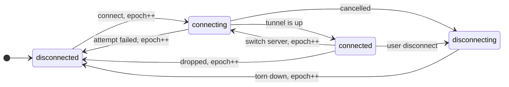
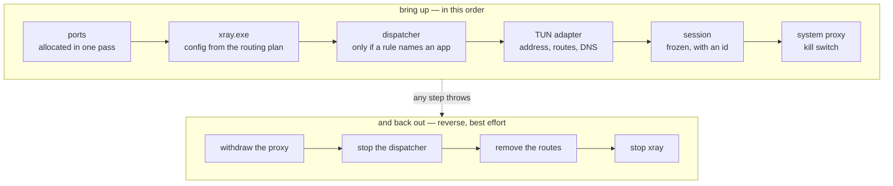

<div align="center">


‎[فارسی](README.fa.md) · **English** · [Русский](README.ru.md) · [↩ Language picker](README.md)

[](https://github.com/mrsoulcommunity/SoulConnection/releases)
[](https://github.com/mrsoulcommunity/SoulConnection/releases)
[](LICENSE)
[](https://github.com/mrsoulcommunity/SoulConnection/releases/latest)

</div>

---

**Soul Connection is a desktop client for VMess, VLESS, Trojan and Shadowsocks servers.** It wraps
the Xray core behind a clean, fully Persian interface and adds the parts most clients leave to
guesswork: an anti-DPI layer that *measures* which treatment your network needs, per-app routing
rules, health monitoring with automatic failover, and a server finder that reports real speed
through the tunnel rather than a bare ping.

<br>

<div align="center">

[](https://github.com/mrsoulcommunity/SoulConnection/releases/latest)

</div>

<br>

## Install

Grab the latest `setup.exe` from the [Releases page](https://github.com/mrsoulcommunity/SoulConnection/releases/latest).
One installer covers **both 32-bit (ia32) and 64-bit (x64) Windows** — it detects your system and
installs the matching build. Windows 10 or later is recommended.

> **Note**
>
> The installer is not code-signed, so SmartScreen may warn on first run: choose
> **More info → Run anyway**. Some antivirus products also flag the bundled `xray.exe`. If the app
> reports that `xray.exe` is missing, add the install folder to your antivirus exclusions and
> reinstall.

A **portable** build is also available. It keeps everything in a `data` folder beside the
executable and leaves nothing on the host machine — delete the folder and it's gone.

<br>

## Features

### Connecting

| | |
|---|---|
| **Protocols** | VMess (AEAD, alterId 0), VLESS with Reality and XTLS Vision, Trojan, Shadowsocks including 2022-blake3 ciphers |
| **Transports** | TCP, WebSocket, gRPC, HTTP/2, mKCP — with TLS or Reality |
| **Connection modes** | **System Proxy** writes the Windows proxy settings for you; **Tunnel (TUN)** routes the whole device through Wintun and needs admin rights |
| **Local proxy** | SOCKS and HTTP listeners on `127.0.0.1` with optional username/password. Ports are configurable and automatically bumped to the next free one when taken |
| **Kill switch** | Windows Firewall rules that block all outbound traffic the moment the tunnel drops, so nothing leaks around it |
| **Auto-reconnect** | Detects an unexpected drop and retries with a growing backoff. How many attempts and how long a step are yours to set, and both are read live — a change applies to the next drop, not after a restart. A core killed from outside the app counts as a drop and recovers the same way |

### Adaptive Shield — anti-DPI that measures instead of guessing

Deep packet inspection can't read your payload, so it decides from the *shape* of the first few
packets. The TLS ClientHello is the richest target: it arrives in one predictable write and carries
the SNI in clear text. Xray can already defend against that — `fragment` slices the ClientHello so
no single packet contains a whole one, and `noises` injects unrelated traffic ahead of the
handshake to pollute the classifier's fingerprint.

Every other client exposes those as a switch you're expected to guess at. Soul Connection races
them instead:

- **It measures.** The tuner runs the candidate treatments against your actual server and keeps the
  one that measurably beats a plain connection. "No treatment" is a real contender, not a special
  case — fragmentation costs round trips and noise costs bandwidth, so a network that doesn't need
  them doesn't pay for them.
- **It remembers per network.** A result is only true for one *(server, network)* pair. The
  fragmentation that rescued a censored mobile carrier is pure overhead on office wifi. Each choice
  is stored against a fingerprint of the link it was measured on and silently ignored elsewhere:
  move networks and it re-tunes, move back and the earlier answer is still there.
- **The fingerprint never leaves your machine.** It's a hash of the local subnet and interface MAC,
  only ever compared against itself.

Modes: `auto` (measure per server), `manual` (pin one profile), `off`.

### Smart Routing

Three modes — everything through the proxy, everything direct, or **Smart**, where your own rules
decide. A rule matches on an executable, a domain, or both:

| Rule | Effect |
|---|---|
| `chrome.exe` → Proxy | one app through the tunnel |
| `*.ir` → Direct | a domain and every subdomain stay local |
| `steam.exe` + `*.steamcontent.com` → Direct | app and domain together, beating a broader rule |

Domains are accepted in any form a person would paste — a bare host, a pasted URL, a leading dot,
a trailing port. LAN and localhost stay off the tunnel by default. The same rule set is compiled
into the Xray config *and* evaluated per connection by the dispatcher, so both layers always agree.

### Choosing a server

- **Server Finder** — TCP ping, real latency measured *through* the tunnel, and download/upload
  speed, combined into a single score you can sort by.
- **Soul Connection pool** — a curated server list the app maintains itself, separate from your own
  profiles. Selection is a two-stage funnel: a cheap TCP fan-out across every server, then a real
  tunnel test on the few survivors. It avoids the classic public-pool failure, a host that answers
  on `:443` while its tunnel is dead or throttled.
- **Automatic failover** — health monitoring watches loss, latency and jitter on the live tunnel
  and moves you when it degrades. Three temperaments (`conservative`, `balanced`, `fast`) and four
  independent brakes — consecutive bad samples, a real quality margin, a cooldown, and a ban on
  returning to the server it just left — so it never oscillates between two servers.
- **Measuring a whole list** — ping every server in the sidebar and watch it happen: the toolbar
  button becomes a ring that fills as results land, with a live count and a stop square in the
  middle. Stopping actually stops — a dozen measurements run at once, and the abort is checked
  between samples rather than left for a dozen timeouts to run out. A row abandoned that way
  reverts to what it showed before, because it was not measured and it did not fail; painting it
  red would be inventing a result. When the sweep ends, a strip reports how many answered, the best
  latency, and how many did not.

### Managing configs

- **Subscriptions** — import by URL, refresh manually or on a timer, with remaining-quota display.
- **Bulk paste** — paste one link or a whole wall of them; every valid config is extracted and
  deduplicated.
- **QR sharing** — render any config as a QR code, then copy or save it.
- **Backup & restore** — export and import all profiles, subscriptions and settings as one JSON file.

### Day to day

- **Live stats** — real-time upload/download speed and per-server lifetime usage, read from Xray's
  gRPC StatsService.
- **Tray integration** — connect, disconnect and switch servers without opening the window.
- **Startup behaviour** — launch on login, start minimised, minimise to tray, restore the previous
  session.
- **Auto-update** — checks GitHub Releases, downloads with live speed and ETA, verifies SHA-512,
  and installs silently after a cancellable countdown. Downloads are resumable and land in an
  `Updates` folder beside the app, so declining the automatic install leaves a ready-to-run setup
  file rather than nothing. Policy is yours: `auto`, `download only`, or `notify`.

### Settings you can find

Eighteen cards over five screens is not something you scroll through looking for one switch, so
Settings has a search that filters whole cards by any text they render — title, description,
labels, hints, and the values inside their fields, which means typing a port number finds the card
holding it. Arabic and Persian spellings of the same letter fold together, as do Persian and Latin
digits, so «كانفيگ» finds «کانفیگ» and «۱۰۸۰۸» finds «10808». Passwords are deliberately left out
of the index: a secret must not become discoverable by typing it into a search box.

- **Notifications** — a master switch plus one per category (connect and disconnect, automatic
  server switches, updates). Failures you have to act on are uncategorised and follow the master
  switch alone, so silencing "tell me when I connect" cannot also silence "the Kill Switch could
  not be applied".
- **Tunnel DNS** — the resolvers tunnel mode hands to Windows. One setting feeds both halves, the
  adapter and Xray's own DoH resolver, so the two cannot disagree. IPv4 only, validated in the
  field and again in the main process, because Xray rejects a whole config over one bad entry.
- **Reduce motion** — turns off the ambient animation and shortens the rest to a near-instant
  crossfade. Windows' own preference is honoured separately and independently.
- **Reset to defaults** — settings only. Servers, subscriptions, routing rules and usage totals are
  data, not preferences, and losing them to a button labelled "reset settings" would be
  indefensible.

### Built to hold the frame

A VPN client sits on screen while it works, so the numbers in it move continuously — and that is
exactly the code most likely to spend the frame budget on nothing.

- **Telemetry lives outside React.** Traffic and latency used to be App state, so two numbers in
  the footer re-rendered the entire app once a second, forever, while connected. They are now in a
  store the footer and the tunnel panel subscribe to directly. Measured over ten connected seconds:
  31 dropped frames out of 566 became 1 out of 600, and the 95th-percentile frame went from 33.3 ms
  — every other frame missed — to 16.8 ms.
- **A ping sweep publishes one frame at a time.** Twelve concurrent measurements each used to write
  twice, and each write rebuilt the sidebar. A 400-server sweep went from 10 dropped frames with a
  116.7 ms worst case to none, worst case 16.8 ms.
- **Only cheap properties animate.** Progress bars, the connect button's glow and the tunnel
  panel's collapse were animating `width`, a 152px `box-shadow` and a `max-height` — all of which
  re-run layout or paint every frame. They are transforms, an opacity crossfade and a grid row now.
- **One motion vocabulary.** Four durations and three curves on `:root`, so two panels that open
  the same way open at the same speed.

<br>

## Architecture

Two boundaries decide almost everything about how this app is put together. The first runs between
the renderer and the main process: the UI draws, and the main process owns every privileged thing —
the Xray process, the registry, the routing table, the firewall. They meet at exactly one file. The
second runs inside the main process, between *being an app* and *being connected*.


The renderer never touches Node. It talks to the main process only through the `contextBridge`
preload — `nodeIntegration` is off, the renderer is sandboxed, and every channel is a
`domain:verb` invoke or a pushed state update. Adding an endpoint means editing exactly three
files, and one of them is the browser mock the UI is developed against.

### Connecting is not one action

It is a process, a routing dispatcher, a network adapter with routes, the Windows proxy
configuration, a firewall block, three measurement loops and a failover engine — and they all have
to agree with each other. That coordination used to be ordering rules spread across a 2,400-line
`main.cjs`, where every subsystem re-derived whether it should be running by reading a handful of
module-level variables. Two of those were written from *outside* the serialization lock, which is
how a disconnect issued during a server-selection sweep could be quietly overwritten by the connect
the sweep went on to perform.

It lives in `electron/vpn/` now, and three ideas carry the whole design.

**One session.** A frozen value describing the live tunnel, with an identity. "Is this still the
tunnel I was looking at?" is `a.id === b.id`, everywhere. Every subsystem *follows* the session, so
re-broadcasting it changes nothing.

**One state machine.** Legal transitions only; anything else is refused rather than applied, so a
crash landing at the same moment as a user disconnect cannot rewind the machine into a state the
caller has already left behind. An `epoch` counts attempts, so a result that arrives late is
recognisably stale and can be dropped instead of acted on.



Every arrow that is not drawn is refused. `connecting → connected` is deliberately the one arrow
that does *not* bump the epoch: those two states are the same attempt, so work started during the
handshake stays valid once it succeeds. And `connected → connecting` exists because switching
servers really does begin a new attempt while the old tunnel is still carrying traffic — modelling
that honestly is what lets a failed switch return you to `connected` over the tunnel you still
have, instead of reporting "disconnected" over a live connection.

**One activity.** The single cancellable span of long work — a selection sweep, a reconnect
countdown. At most one exists, and starting another cancels the first. This is what makes "the user
pressed disconnect" reliably stop work that has not reached the connection lock yet; an epoch alone
cannot do it, because a pending reconnect sits in `disconnected` with nothing to bump.

### Up in order, back out in reverse



The order is not stylistic. Routes have to come out before the adapter disappears, or the machine
is left routing into an adapter that no longer exists — no internet at all, tunnel or otherwise.
The dispatcher has to stop before Xray, or it keeps accepting connections and forwarding them into
ports nothing is listening on. The system proxy is withdrawn *before* the listener dies, because
Windows pointed at a port that just stopped accepting is the same outage by a different route.

If any step of the bring-up throws, everything that went in comes back out before the error reaches
the caller. A surviving Xray is not harmless: `start()` refuses while one is alive, so every later
connect would fail with "Xray is already running" until the app was restarted.

### Nothing in the core builds anything

`core.cjs` receives every collaborator through its constructor — the process, the adapter, the
registry writer, the firewall, the clock. `index.cjs` is the only composition root, the only file
that knows which implementation is the real one, and nothing outside `vpn/` constructs anything
from `vpn/`. That is what makes ordering, cancellation and rollback testable with no Windows, no
Xray and no network: `npm test` runs **98 tests** on Node's own runner, with no dependencies, and
asserts on the order the calls actually happened in — which is where the historical bugs lived.

### Where things live

| Path | What it owns |
|---|---|
| `electron/main.cjs` | the Electron shell — window, tray, IPC, profiles, subscriptions, settings |
| `electron/preload.cjs` | the entire `contextBridge` surface (`window.soul`). Nothing else is exposed |
| `electron/vpn/` | the connection lifecycle — machine, session, tunnel, ports, endpoints, telemetry, failover |
| `electron/lib/` | the leaf mechanics, one concern per file — the store, the parsers, the config builder, the Windows edges |
| `src/` | the renderer. `App.jsx` holds the state; components are presentational and take callbacks |
| `test/` | `node:test` suites over the coordination layer, built from hand-written fakes |

### Data that survives a crash

Profiles, subscriptions and settings are a single JSON file, written crash-safely — a temp file is
fsynced, the current file is snapshotted to `.bak`, then an atomic rename swaps it in. A power loss
leaves you with either the old file or the new one, never half of each. An unreadable file falls
back to the backup, and if that fails too it is quarantined rather than overwritten.

<br>

## Tech stack

| Layer | Technology |
|-------|------------|
| **UI** | React 18 (plain JSX), hand-written CSS, Vazirmatn variable font |
| **Desktop shell** | Electron 33 |
| **Build tool** | Vite 5 |
| **Core engine** | Xray-core (bundled `xray.exe`, per architecture) |
| **Stats** | gRPC (`@grpc/grpc-js`) against Xray's StatsService |
| **Tunnel driver** | Wintun (`wintun.dll`) |
| **Tests** | `node:test` — 98 tests, no dependencies, no network, no Windows |
| **Packaging** | electron-builder (NSIS) |

<br>

## Building from source

**Prerequisites** — [Node.js](https://nodejs.org/) 18 or newer, Git, and Windows (the app and its
build targets are Windows-only).

```bash
git clone https://github.com/mrsoulcommunity/SoulConnection.git
cd SoulConnection
npm install
```

`bin/` is not tracked in git. Populate it with the Xray core and the Wintun driver before building:

```text
bin/
├── geoip.dat
├── geosite.dat
├── win-x64/
│   ├── xray.exe        # 64-bit Xray core
│   └── wintun.dll      # 64-bit Wintun driver
└── win-ia32/
    ├── xray.exe        # 32-bit Xray core
    └── wintun.dll      # 32-bit Wintun driver
```

| Command | Description |
|---------|-------------|
| `npm test` | Run the 98 `node:test` suites. Needs neither Windows nor `bin/` |
| `npm run dev` | Build the UI bundle and launch Electron |
| `npm run start` | Same as `dev` |
| `npm run build:ui` | Build only the Vite renderer bundle into `dist/` |
| `npm run dist` | Build `release/setup.exe` (x64 + ia32 in one installer) |
| `npm run dist:publish` | Same as `dist`, then publish to GitHub Releases (needs `GH_TOKEN`) |
| `npm run dist:portable` | Build a single-file portable x64 executable |

<br>

## Project structure

```text
SoulConnection/
├── electron/
│   ├── main.cjs              # The Electron shell: window, tray, IPC, profiles, subscriptions
│   ├── preload.cjs           # The entire contextBridge surface (window.soul)
│   ├── vpn/                  # THE VPN CORE — one lifecycle, every collaborator injected
│   │   ├── core.cjs          #   connect, disconnect, drops, reconnect, failover
│   │   ├── index.cjs         #   the composition root: the only file that builds anything
│   │   ├── machine.cjs       #   states, epochs, activities, the exclusive lock
│   │   ├── session.cjs       #   one live tunnel, frozen, with an identity
│   │   ├── tunnel.cjs        #   xray + dispatcher + routes, in order, with rollback
│   │   ├── ports.cjs         #   the whole port layout, allocated in one pass
│   │   ├── endpoints.cjs     #   which address and port to dial, for which purpose
│   │   └── …                 #   routingPlan, telemetry, tunnelStatus, killSwitchGuard, reconnect
│   └── lib/
│       ├── shield/           # Adaptive Shield: profiles, tuner, per-network memory
│       ├── routing/          # Smart Routing: pure rules, dispatcher, Xray compiler
│       ├── health/           # Measurement (monitor) and policy (failover), kept apart
│       ├── update/           # Feed, resumable download, SHA-512 verify, installer
│       ├── xrayProcess.cjs   # Xray's lifetime and its log stream
│       ├── xrayConfig.cjs    # Config builder: inbounds, outbounds, TUN, DNS, shield
│       ├── killSwitch.cjs    # Windows Firewall rules
│       ├── systemProxy.cjs   # Windows proxy settings
│       ├── tunNetwork.cjs    # TUN interface setup
│       ├── soulPool.cjs      # Curated server pool
│       └── store.cjs         # Crash-safe JSON store
├── src/
│   ├── App.jsx               # Root component; owns nearly all renderer state
│   ├── components/           # One file per screen or panel
│   ├── finder/               # Server Finder's test-batch engine
│   ├── telemetryStore.js     # Traffic and latency, kept outside React
│   ├── utils/                # Pure helpers: format, geo, ping shape, score, session
│   └── index.css             # The entire stylesheet, CSS variables on :root
├── test/                     # node:test suites over electron/vpn
├── docs/assets/              # Banner and architecture diagram
├── bin/                      # Xray core + Wintun (not tracked; see above)
├── scripts/build-exe.cjs     # Packaging pipeline
├── vite.config.js
└── package.json              # Also holds the electron-builder config
```

<br>

## Where your data lives

Profiles, subscriptions and settings are one JSON file:

- **Installed build** — `%APPDATA%\soul-connection\profiles.json`
- **Portable build** — `data\profiles.json`, next to the executable

<br>

## Troubleshooting

<details>
<summary><b>The app says <code>xray.exe</code> is missing</b></summary>

An antivirus has quarantined the bundled core. Add the install folder to its exclusions and
reinstall.
</details>

<details>
<summary><b>Tunnel (TUN) mode won't start</b></summary>

TUN mode installs a virtual network interface and needs administrator rights. Run the app as
administrator, and make sure `wintun.dll` shipped alongside `xray.exe`.
</details>

<details>
<summary><b>Connected, but nothing loads</b></summary>

Check that System Proxy is actually applied (Settings → Network), that Smart Routing isn't sending
the traffic direct, and try the Server Finder's real-latency test — a server can accept TCP on
`:443` while its tunnel is dead.
</details>

<details>
<summary><b>Everything is slow on this network</b></summary>

Let Adaptive Shield re-tune. Its results are stored per network, so a fresh wifi or hotspot starts
without one until it measures.
</details>

<details>
<summary><b>Something went wrong and I want the logs</b></summary>

Settings → open the logs folder. Raise `xrayLogLevel` first if you need more detail.
</details>

<br>

## Contributing

1. Fork the repository.
2. Create a feature branch — `git checkout -b feature/amazing-feature`.
3. Commit your changes, and keep `npm test` green — it needs neither Windows nor `bin/`, so there
   is no excuse for a red suite in a pull request.
4. Push the branch and open a Pull Request.

Before you start, `CLAUDE.md` in the repository root is the map — what each directory is for, the
conventions the code follows, and the failure modes the designs exist to prevent. `electron/vpn/README.md`
goes deeper on the connection core.

Bug reports and feature requests are welcome in [Issues](https://github.com/mrsoulcommunity/SoulConnection/issues).

<br>

## License

MIT — see [LICENSE](LICENSE). Bundled third-party components keep their own licenses: Xray-core
(MPL-2.0) and Wintun, both covered by the notices shipped in `bin/`.

## Disclaimer

This software is intended for legitimate privacy protection and educational use only. The
developers are not responsible for any misuse. Users must comply with the laws and regulations that
apply to them regarding internet usage and proxy services.

<br>

<div align="center">

**Soul Community** — [mrsoulcommunity](https://github.com/mrsoulcommunity)

<sub>Made with ❤️ by the Soul Team</sub>

[GitHub](https://github.com/mrsoulcommunity/SoulConnection) ·
[Issues](https://github.com/mrsoulcommunity/SoulConnection/issues) ·
[Releases](https://github.com/mrsoulcommunity/SoulConnection/releases)

</div>
