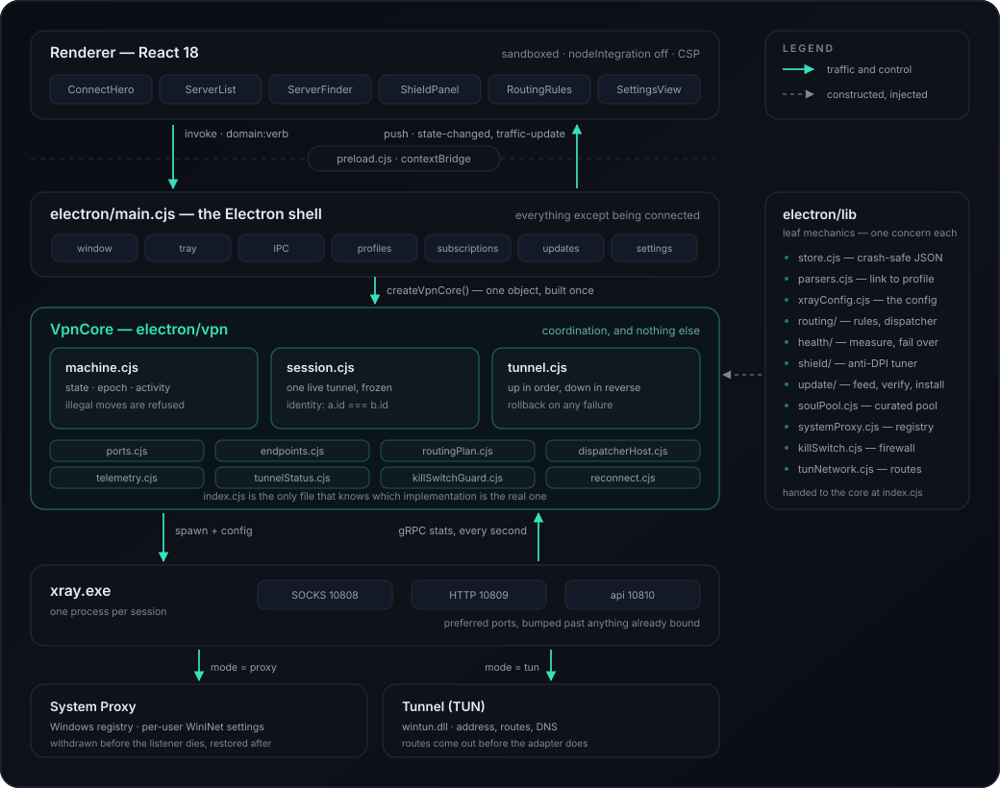
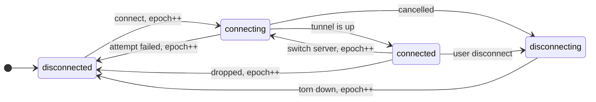
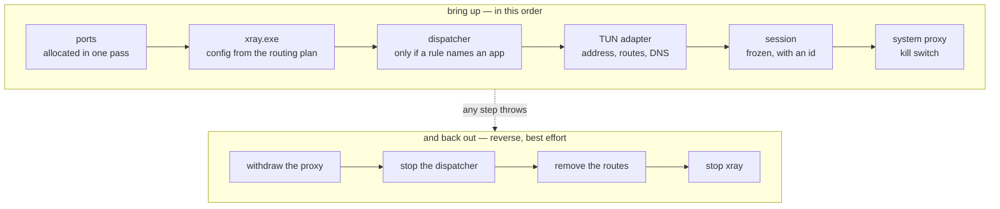

<div align="center">


**فارسی** · [English](README.en.md) · [Русский](README.ru.md) · [↩ انتخاب زبان](README.md)

[](https://github.com/mrsoulcommunity/SoulConnection/releases)
[](https://github.com/mrsoulcommunity/SoulConnection/releases)
[](LICENSE)
[](https://github.com/mrsoulcommunity/SoulConnection/releases/latest)

</div>

---

<div dir="rtl" align="right">

**سول کانکشن یک کلاینت دسکتاپ برای سرورهای VMess، VLESS، Trojan و Shadowsocks است.** هستهٔ Xray را
پشت یک رابط کاربری تمیز و کاملاً فارسی می‌گذارد و چیزهایی را اضافه می‌کند که بیشتر کلاینت‌ها به حدس
کاربر واگذار می‌کنند: لایه‌ای ضدِ DPI که *اندازه می‌گیرد* شبکهٔ شما به چه درمانی نیاز دارد، قواعد
مسیریابی برای هر برنامه، پایش سلامت اتصال با جابه‌جایی خودکار، و یابنده‌ای که سرعت واقعیِ داخل تونل
را گزارش می‌کند نه یک پینگ خالی را.

</div>

<br>

<div align="center">

[](https://github.com/mrsoulcommunity/SoulConnection/releases/latest)

**دریافت آخرین نسخه برای ویندوز**

</div>

<br>

<div dir="rtl" align="right">

## نصب

آخرین فایل `setup.exe` را از [صفحهٔ Releases](https://github.com/mrsoulcommunity/SoulConnection/releases/latest)
بگیرید. یک نصب‌کننده هم **ویندوز ۳۲ بیتی (ia32)** و هم **۶۴ بیتی (x64)** را پوشش می‌دهد؛ خودش سیستم
شما را تشخیص می‌دهد و نسخهٔ درست را نصب می‌کند. ویندوز ۱۰ به بالا توصیه می‌شود.

> **نکته**
>
> نصب‌کننده امضای دیجیتال (code signing) ندارد، پس ممکن است SmartScreen در اجرای اول هشدار بدهد؛
> روی **More info** و سپس **Run anyway** بزنید. بعضی آنتی‌ویروس‌ها هم به `xray.exe` همراه برنامه گیر
> می‌دهند. اگر برنامه گفت `xray.exe` پیدا نشد، پوشهٔ نصب را به فهرست استثناهای آنتی‌ویروس اضافه کنید
> و دوباره نصب کنید.

نسخهٔ **پرتابل** هم موجود است: همه‌چیز را در پوشهٔ `data` کنار فایل اجرایی نگه می‌دارد و هیچ ردی روی
سیستم باقی نمی‌گذارد — پوشه را پاک کنید، انگار هرگز نبوده.

<br>

## تازه‌های نسخهٔ ۱٫۲٫۰

بزرگ‌ترین انتشار تا امروز. کل لایهٔ اتصال پشت یک چرخهٔ حیات واحد بازنویسی شد، لایهٔ ضدِ DPI تازه
اضافه شده، تنظیمات جست‌وجوپذیر شد، و رابط کاربری حالا در حالت متصل ۶۰ فریم بر ثانیه را نگه می‌دارد.
هیچ کانال یا قالب پیامی در IPC عوض نشده، پس سرورها، اشتراک‌ها و قواعد مسیریابیِ موجود دست‌نخورده
منتقل می‌شوند.

### تازه‌ها

| | |
|---|---|
| **سپر تطبیقی** | لایه‌ای ضدِ DPI که به‌جای حدس‌زدن *اندازه می‌گیرد*. مجموعهٔ درمان‌ها را روی شبکهٔ شما امتحان می‌کند، آنکه رد می‌شود را نگه می‌دارد، و پاسخ را کنار یک اثرانگشتِ درهم‌سازی‌شده از همان شبکه به خاطر می‌سپارد — پس شبکه‌ای که یک‌بار حلش کرده‌اید، دفعهٔ بعد مستقیم با درمان درست وصل می‌شود |
| **جست‌وجو در تنظیمات** | هجده کارت در پنج صفحه اسکرول، حالا با هر متنی که کارت نشان می‌دهد فیلتر می‌شوند — عنوان، توضیح، و حتی مقدار داخل فیلدها؛ پس تایپ‌کردن یک شمارهٔ پورت، کارتِ دارندهٔ آن را پیدا می‌کند. املای عربی و فارسیِ یک حرف روی هم تا می‌خورند، همین‌طور ارقام فارسی و لاتین: «كانفيگ» به «کانفیگ» می‌رسد و «۱۰۸۰۸» به «10808». رمزها عمداً از این فهرست بیرون‌اند — یک راز نباید با تایپ‌کردنش در جعبهٔ جست‌وجو پیدا شود |
| **دسته‌بندی اعلان‌ها** | یک کلید اصلی، به‌علاوهٔ یکی برای هر دسته: وصل/قطع، جابه‌جایی خودکار سرور، و به‌روزرسانی‌ها. خطاهایی که باید کاری برایشان بکنید بی‌دسته می‌مانند و فقط از کلید اصلی پیروی می‌کنند، تا خاموش‌کردن «وقتی وصل شدم بگو» نتواند «کلید قطع اعمال نشد» را هم ساکت کند |
| **اتصال مجدد خودکارِ قابل تنظیم** | چند بار تلاش، و با چه فاصله‌ای بین تلاش‌ها. هر دو زنده خوانده می‌شوند، پس تغییرشان روی همان افتادن بعدی اثر می‌کند نه بعد از راه‌اندازی دوباره — و هر دو موقع ورود کران‌دار می‌شوند |
| **DNS حالت تانل** | نشانی resolverهایی که حالت تانل به ویندوز می‌دهد پیش‌تر در کد ثابت بود. حالا یک تنظیم هر دو نیمه را تغذیه می‌کند — کارت شبکه و resolverِ DoH خودِ xray — تا این دو نتوانند با هم اختلاف پیدا کنند. هم در فیلد و هم دوباره در فرایند اصلی اعتبارسنجی می‌شود، چون xray کل کانفیگ را به‌خاطر یک ورودی خراب پس می‌زند |
| **کاهش جلوه‌های حرکتی** | کلیدی درون برنامه، در کنار ترجیح خودِ ویندوز. هرکدام روشن باشد انیمیشن‌ها کم می‌شوند؛ پیش‌تر فقط تنظیم سیستم خوانده می‌شد |
| **بازگرداندن تنظیمات** | ترجیحات را به پیش‌فرض برمی‌گرداند و به هیچ‌چیز دیگری دست نمی‌زند. سرورها، اشتراک‌ها، قواعد مسیریابی و آمار مصرف *داده*‌اند، نه ترجیح |

### بازنویسی‌شده

**یک چرخهٔ حیات برای اتصال.** هرچه به وصل‌بودن مربوط است — فرایند xray، توزیع‌کنندهٔ مسیریابی
هوشمند، کارت شبکهٔ تانل و مسیرهایش، پیکربندی پراکسی ویندوز، کلید قطع، سه حلقهٔ اندازه‌گیری، سلامت و
جابه‌جایی خودکار — پیش‌تر با قواعد ترتیبیِ پخش‌شده در یک `main.cjs` ۲٬۳۵۹ خطی کنار هم نگه داشته
می‌شد. حالا در `electron/vpn/` پشت یک چرخهٔ حیات واحد است که هر زیرسیستم آن را *دنبال می‌کند* و از
نو استنتاج نمی‌کند. رقابت‌هایی (race) که این کار حذف کرد، نه اینکه جابه‌جا کند:

- قطعِ درخواست‌شده هنگام جاروی انتخاب سرور، با وصلی که همان جارو بعداً انجام می‌داد بازنویسی می‌شد.
- قطع‌کردن در میانهٔ شمارش معکوسِ اتصال مجدد، باز هم شما را وصل می‌کرد — شمارش یک تایمر خالی بود و
  بعد از سررسیدش هیچ‌چیز نیت شما را دوباره بررسی نمی‌کرد.
- هر دو حلقهٔ اندازه‌گیری با هر پخشِ وضعیت از نو راه می‌افتادند، از جمله تیکِ هر شش ثانیه. راه‌اندازی
  دوبارهٔ حلقهٔ ترافیک مبنایش را صفر می‌کرد، پس سرعتِ گزارش‌شده چند بار در دقیقه به کل بایت‌های
  نشست تقسیم بر یک ثانیه جهش می‌کرد.
- «وصل شو به بهترین سرور» در حالی که وصل بودید، اگر جارو چیزی پیدا نمی‌کرد روی یک تونل زنده
  *قطع* گزارش می‌داد.
- چهار پورت توزیع‌کننده جداگانه تخصیص می‌یافتند، پس یک پورت مشغول می‌توانست به دو ورودی هم‌زمان
  داده شود — و xray کانفیگ را پس می‌زد.
- لغوی که وسط دست‌دادن (handshake) می‌رسید، تونل را بالا رها می‌کرد، آن هم بعد از اعلام اتصالی که
  خودتان خواسته بودید تمام شود.

**جارویی که می‌شود تماشا و متوقفش کرد.** اندازه‌گیری یک دسته سرور پیش‌تر پشت چرخانه‌ای اجرا می‌شد که
فقط می‌گفت «چیزی دارد اتفاق می‌افتد» — روی اشتراکی با پنجاه سرور، نیم دقیقه از آن. حالا خودِ دکمهٔ
نوار ابزار نمایشگر است: حلقه‌ای که با اندازه‌گیری سرورها پر می‌شود، شمارش زنده و نوار پیشرفت، و یک
خلاصه در پایان. توقف واقعاً متوقف می‌کند — اندازه‌گیری‌هایی که در هوا مانده‌اند لغو می‌شوند، نه اینکه
منتظر تمام‌شدنشان بمانیم. ردیفی که این‌طور رها شود به همان چیزی که پیش‌تر نشان می‌داد برمی‌گردد:
اندازه‌گیری نشده و شکست هم نخورده، پس قرمزکردنش یعنی ساختن یک نتیجه از هیچ.

**۶۰ فریم بر ثانیه.** داده‌های تله‌متری از state رِاکت به انباره‌ای بیرون آن منتقل شدند که پاورقی و
پنل تانل مستقیم مشترکش می‌شوند، پس دو عدد در پاورقی دیگر هر ثانیه — تا ابد — کل برنامه را از نو
رندر نمی‌کنند. نتیجهٔ پینگ‌ها به‌جای دو نوشتن به‌ازای هر اندازه‌گیری، فریم‌به‌فریم منتشر می‌شود. شش نوار
پیشرفت، سایهٔ دکمهٔ اتصال و جمع‌شدن پنل تانل حالا transform و opacity و یک سطر گرید را متحرک می‌کنند،
نه ویژگی‌هایی که هر فریم چیدمان را از نو اجرا می‌کنند. اندازه‌گیری‌شده در ده ثانیهٔ اتصال: <span dir="ltr">31</span>
فریمِ افتاده از <span dir="ltr">566</span> شد <span dir="ltr">1</span> از <span dir="ltr">600</span>،
و صدکِ ۹۵ فریم از <span dir="ltr">33.3ms</span> به <span dir="ltr">16.8ms</span> رسید. جاروی
۴۰۰ سرور از <span dir="ltr">10</span> فریمِ افتاده با بدترین حالت <span dir="ltr">116.7ms</span>
به صفر رسید، با بدترین حالت <span dir="ltr">16.8ms</span>.

**یک زبانِ حرکت واحد.** چهار مدت‌زمان و سه منحنی روی `:root` جای حدود ۶۵ زمان‌بندیِ دستی را گرفتند،
پس دو پنلی که یک‌جور باز می‌شوند، حالا با یک سرعت باز می‌شوند.

### رفع اشکال

- تونلی که از بیرونِ برنامه کشته می‌شد دیگر راه نمی‌افتاد: هر اتصال مجدد با خطای «Xray از پیش در
  حال اجراست» شکست می‌خورد تا خودِ برنامه دوباره اجرا شود. زنده‌بودن حالا رویدادمحور است، پس هسته‌ای
  که از بیرون کشته شود خودش برمی‌گردد.
- پیام‌های خطا با رنگ سبزِ موفقیت نمایش داده می‌شدند — همهٔ مسیرهای خطا پرچم `'error'` را جا انداخته بودند.
- پیام شناور ۲٫۶ ثانیه کل نوار وضعیت را می‌پوشاند و دقیقاً در لحظهٔ اتصال، مدت و سرعت و پینگ و نام
  سرور را محو می‌کرد. حالا بالای نوار شناور است.
- دو کارت مختلف در تنظیمات هر دو «پیشرفته» نام داشتند.
- صفحهٔ اصلی «سروری انتخاب نشده» می‌گفت در حالی که نوار کناری استخر Soul یا انتخاب خودکار را نشان
  می‌داد — هر دو انتخاب‌های واقعی‌اند.
- یک مقیاس تأخیر جای سه مقیاس را گرفت: <span dir="ltr">350ms</span> پیش‌تر در نوار کهرباییِ
  «متوسط» بود و در پنلِ دقیقاً بالای آن قرمزِ «ضعیف»، در یک لحظهٔ واحد.
- نام‌های لاتین سرور از *ابتدا* کوتاه می‌شدند — «Tokyo — NTT Premium» به‌شکل «…NTT Premium»
  دیده می‌شد و نیمهٔ هویت‌بخشش را از دست می‌داد.
- شش منوی کشویی در تنظیمات شش عرض مختلف داشتند؛ غیرفعال‌ها شبیه قابل‌کلیک بودند؛ و پیکانِ خودِ
  کرومیوم از هر پیکان دیگری در برنامه گلیف و وزن و رنگ متفاوتی داشت. هر سه درست شد.
- پیلِ لغزندهٔ کلید حالت، ۱۵ پیکسل باریک‌تر از «پروکسی سیستم» و ۱۵ پیکسل پهن‌تر از «تانل کامل» بود،
  پس متن به‌وضوح از آن بیرون می‌زد.
- حالتِ مسدودسازیِ کلید قطع هرگز به نوار وضعیت نمی‌رسید.
- ‏Ctrl+F داخل جعبهٔ جست‌وجوی خودِ نوار کناری، یابندهٔ سرور را باز می‌کرد؛ و Ctrl+K آن را پشت پنجرهٔ
  باز باز می‌کرد.
- چند رشتهٔ لاتینِ درون متن راست‌به‌چپ را الگوریتم دوسویه (bidi) روی شکست خط جابه‌جا می‌کرد —
  `Host/Port/احراز هویت` به‌شکل «I/Host/Port» درمی‌آمد.

### در پشت صحنه

فرمان `npm test` حالا **۹۸ آزمون** را روی اجراکنندهٔ داخلی Node اجرا می‌کند — بدون هیچ وابستگی،
بدون شبکه، بدون ویندوز و بدون فایل اجرایی xray. پوشش روی لایهٔ هماهنگی است، همان‌جا که باگ‌های
تاریخی زندگی می‌کردند: ترتیب، لغو، و بازگردانی. ببینید [ساخت از روی کد](#ساخت-از-روی-کد).

<br>

## امکانات

### اتصال

| | |
|---|---|
| **پروتکل‌ها** | VMess (با AEAD و alterId صفر)، VLESS همراه Reality و XTLS Vision، Trojan، و Shadowsocks شامل رمزهای <span dir="ltr">2022-blake3</span> |
| **انتقال‌ها** | TCP، WebSocket، gRPC، HTTP/2، mKCP — با TLS یا Reality |
| **حالت‌های اتصال** | **پراکسی سیستم** تنظیمات پراکسی ویندوز را برایتان می‌نویسد؛ **تونل (TUN)** کل دستگاه را از طریق Wintun عبور می‌دهد و به دسترسی مدیر نیاز دارد |
| **پراکسی محلی** | شنونده‌های SOCKS و HTTP روی `127.0.0.1` با نام کاربری و رمز اختیاری. پورت‌ها قابل تنظیم‌اند و اگر اشغال باشند خودکار به اولین پورت آزاد منتقل می‌شوند |
| **کلید قطع** | قواعد فایروال ویندوز (Kill Switch) که لحظهٔ افتادن تونل تمام ترافیک خروجی را می‌بندند تا چیزی از کنار تونل بیرون نزند |
| **اتصال مجدد خودکار** | افتادن ناگهانی تونل را تشخیص می‌دهد و با فاصلهٔ فزاینده دوباره تلاش می‌کند. تعداد تلاش‌ها و اندازهٔ فاصله دست خودتان است و هر دو زنده خوانده می‌شوند — تغییرشان روی همان افتادن بعدی اثر می‌کند، نه بعد از راه‌اندازی دوباره. هستهٔ کشته‌شده از بیرونِ برنامه هم یک افتادن است و از همان راه برمی‌گردد |

### سپر تطبیقی — ضدِ DPI، با اندازه‌گیری به‌جای حدس

بازرسی عمیق بسته (DPI) نمی‌تواند محتوای شما را بخواند، پس از روی *شکلِ* چند بستهٔ اول تصمیم می‌گیرد.
پیام ClientHello در TLS چرب‌ترین هدف است: در یک نوشتِ قابل‌پیش‌بینی می‌رسد و SNI را بدون رمز حمل
می‌کند. Xray از قبل ابزار مقابله را دارد — `fragment` این پیام را چنان تکه‌تکه می‌کند که هیچ بسته‌ای
یک ClientHello کامل نداشته باشد، و `noises` پیش از دست‌دادن اولیه ترافیک بی‌ربط تزریق می‌کند تا اثر
انگشت آماری‌ای که دسته‌بند جمع کرده به‌هم بریزد.

هر کلاینت دیگری این‌ها را به شکل کلیدی عرضه می‌کند که قرار است خودتان حدس بزنید کدام را بزنید. سول
کانکشن به‌جای حدس، آن‌ها را با هم مسابقه می‌دهد:

- **اندازه می‌گیرد.** تیونر گزینه‌ها را روی سرور واقعی شما اجرا می‌کند و همانی را نگه می‌دارد که
  به‌طور قابل‌اندازه‌گیری از اتصال ساده بهتر باشد. «بدون تغییر» هم یک رقیب واقعی است نه استثنا —
  تکه‌تکه‌کردن هزینهٔ رفت‌وبرگشت دارد و نویز پهنای باند می‌خورد، پس شبکه‌ای که به آن‌ها نیاز ندارد
  بهایشان را هم نمی‌پردازد.
- **به‌ازای هر شبکه به‌خاطر می‌سپارد.** یک نتیجه فقط برای یک زوجِ *(سرور، شبکه)* درست است.
  تکه‌تکه‌کردنی که روی یک اپراتور موبایل فیلترشده اتصال را نجات داده، روی وای‌فای دفتر فقط سربار
  است. هر انتخاب کنار اثر انگشت شبکه‌ای ذخیره می‌شود که رویش اندازه‌گیری شده و جای دیگر بی‌سروصدا
  نادیده گرفته می‌شود: شبکه عوض شود دوباره تنظیم می‌کند، برگردید پاسخ قبلی سر جایش است.
- **این اثر انگشت هرگز از دستگاه شما بیرون نمی‌رود.** درهم‌سازی‌ای از زیرشبکهٔ محلی و مکآدرس کارت
  شبکه است که فقط با خودش مقایسه می‌شود.

حالت‌ها: `خودکار` (اندازه‌گیری برای هر سرور)، `دستی` (یک نمایه برای همه)، `خاموش`.

### مسیریابی هوشمند

سه حالت — همه‌چیز از پراکسی، همه‌چیز مستقیم، یا **هوشمند** که قواعد خودتان تصمیم می‌گیرند. هر قاعده
می‌تواند بر اساس یک برنامهٔ اجرایی، یک دامنه، یا هر دو باشد:

| قاعده | نتیجه |
|---|---|
| `chrome.exe` ← پراکسی | فقط یک برنامه از تونل رد می‌شود |
| `*.ir` ← مستقیم | یک دامنه و همهٔ زیردامنه‌هایش محلی می‌مانند |
| `steam.exe` + `*.steamcontent.com` ← مستقیم | برنامه و دامنه با هم، که بر قاعدهٔ کلی‌تر غلبه می‌کند |

دامنه را به هر شکلی که آدم می‌چسباند می‌پذیرد: نام خالی، یک URL کامل، نقطهٔ ابتدایی، یا پورت
انتهایی. شبکهٔ محلی و localhost به‌صورت پیش‌فرض از تونل رد نمی‌شوند. همین مجموعه قواعد هم به تنظیمات
Xray ترجمه می‌شود و هم به‌ازای هر اتصال توسط توزیع‌کننده ارزیابی می‌شود، تا این دو لایه هیچ‌وقت با
هم اختلاف پیدا نکنند.

### انتخاب سرور

- **یابندهٔ سرور** — پینگ TCP، تأخیر واقعی که *از داخل* تونل اندازه‌گیری می‌شود، و سرعت دانلود و
  آپلود؛ همه در یک امتیاز واحد جمع می‌شوند که می‌توانید بر اساسش مرتب کنید.
- **استخر سرورهای سول کانکشن** — فهرستی گزیده که خودِ برنامه نگه‌داری می‌کند و از پروفایل‌های شما
  جداست. انتخاب دو مرحله‌ای است: اول یک آزمون TCP ارزان روی همهٔ سرورها، بعد آزمون تونل واقعی روی
  چند بازمانده. همین جلوی خطای کلاسیک استخرهای عمومی را می‌گیرد: میزبانی که روی `:443` جواب می‌دهد
  ولی تونلش مرده یا خفه شده است.
- **جابه‌جایی خودکار** — پایش سلامت، اتلاف بسته و تأخیر و لرزش را روی تونل زنده می‌بیند و وقتی افت
  کند شما را جابه‌جا می‌کند. سه خُلق‌وخو (`محافظه‌کار`، `متعادل`، `سریع`) و چهار ترمز مستقل — چند
  نمونهٔ بد پشت سر هم، یک اختلاف کیفیت واقعی، یک دورهٔ خنک‌شدن، و ممنوعیت بازگشت به سروری که تازه
  ترکش کرده — تا هرگز بین دو سرور نوسان نکند.
- **اندازه‌گیری یک فهرست کامل** — همهٔ سرورهای نوار کناری را پینگ بگیرید و تماشا کنید: دکمهٔ نوار
  ابزار خودش تبدیل به گزارش می‌شود؛ حلقه‌ای که با رسیدن هر نتیجه پر می‌شود، شمارشی زنده، و یک
  مربع توقف در وسطش. توقف واقعاً متوقف می‌کند: دوازده اندازه‌گیری هم‌زمان در جریان است و لغو
  بین نمونه‌ها بررسی می‌شود، نه اینکه منتظر بمانیم دوازده مهلت زمانی یکی‌یکی سر برسند. ردیفی که
  این‌طور رها شود به همان چیزی برمی‌گردد که پیش‌تر نشان می‌داد؛ چون نه اندازه‌گیری شده و نه شکست
  خورده، و قرمز کردنش یعنی ساختنِ نتیجه‌ای که وجود ندارد. وقتی هم تمام شد، یک نوار می‌گوید چند
  سرور جواب داده‌اند، بهترین تأخیر چقدر بوده و چندتا جواب نداده‌اند.

### مدیریت کانفیگ‌ها

- **اشتراک‌ها** — افزودن با URL، به‌روزرسانی دستی یا زمان‌بندی‌شده، همراه نمایش حجم باقی‌مانده.
- **چسباندن انبوه** — یک لینک یا یک دیوار لینک را یک‌جا بچسبانید؛ هر کانفیگ معتبری استخراج و تکراری‌ها
  حذف می‌شوند.
- **اشتراک‌گذاری QR** — هر کانفیگ را به‌صورت کد QR ببینید و کپی یا ذخیره کنید.
- **پشتیبان‌گیری و بازیابی** — همهٔ پروفایل‌ها، اشتراک‌ها و تنظیمات در قالب یک فایل JSON.

### در استفادهٔ روزمره

- **آمار زنده** — سرعت لحظه‌ای دانلود و آپلود و مصرف کل هر سرور، از سرویس gRPC StatsService خودِ Xray.
- **سینی سیستم** — اتصال، قطع و تعویض سرور بدون بازکردن پنجره.
- **رفتار هنگام راه‌اندازی** — اجرا با ورود به ویندوز، شروع به‌صورت کوچک‌شده، کوچک‌شدن در سینی،
  بازیابی نشست قبلی.
- **به‌روزرسانی خودکار** — Releases گیت‌هاب را بررسی می‌کند، با نمایش سرعت و زمان باقی‌مانده دانلود
  می‌کند، SHA-512 را بررسی می‌کند و پس از یک شمارش معکوسِ قابل‌لغو بی‌صدا نصب می‌کند. دانلود
  ازسرگرفتنی است و در پوشهٔ `Updates` کنار برنامه می‌نشیند، پس اگر نصب خودکار را رد کنید یک فایل
  نصب آمادهٔ اجرا برایتان می‌ماند، نه هیچ. سیاستش هم با شماست: `خودکار`، `فقط دانلود`، یا `فقط اطلاع`.

### تنظیماتی که پیدا می‌شوند

هجده کارت در پنج صفحه چیزی نیست که برای پیدا کردن یک کلید، تا تهش را بگردید؛ پس تنظیمات حالا یک
جست‌وجو دارد که کارت‌ها را با هر متنی که نشان می‌دهند فیلتر می‌کند — عنوان، توضیح، برچسب‌ها،
راهنماها، و حتی مقدار داخل فیلدها؛ یعنی نوشتن یک شمارهٔ پورت، کارتی را که آن پورت در آن است پیدا
می‌کند. املای عربی و فارسیِ یک حرف روی هم تا می‌شوند و ارقام فارسی و لاتین هم همین‌طور، پس «كانفيگ»
به «کانفیگ» می‌رسد و «۱۰۸۰۸» به «10808». رمزها عمداً از این فهرست بیرون‌اند: یک راز نباید با
تایپ‌کردنش در جعبهٔ جست‌وجو قابل کشف شود.

- **اعلان‌ها** — یک کلید اصلی، به‌علاوهٔ یک کلید برای هر دسته (اتصال و قطع، جابه‌جایی خودکار سرور،
  به‌روزرسانی‌ها). خطاهایی که باید کاری برایشان بکنید دسته‌بندی ندارند و فقط از کلید اصلی پیروی
  می‌کنند، تا خاموش‌کردن «وقتی وصل شدم خبرم کن» نتواند «کلید قطع اعمال نشد» را هم خاموش کند.
- **DNS حالت تانل** — همان resolverهایی که حالت تانل به ویندوز می‌دهد. یک تنظیم به هر دو نیمه
  خورانده می‌شود، هم به کارت شبکه و هم به resolver داخلی Xray روی DoH، تا این دو نتوانند با هم
  اختلاف پیدا کنند. فقط IPv4، یک‌بار در خود فیلد و یک‌بار دیگر در پروسهٔ اصلی اعتبارسنجی می‌شود؛
  چون Xray کل کانفیگ را به‌خاطر یک ورودی بد رد می‌کند و از دست دادن تونل به‌خاطر یک غلط تایپی در
  جعبهٔ DNS معاملهٔ خوبی نیست.
- **کاهش جلوه‌های حرکتی** — انیمیشن‌های همیشه‌درجریان را خاموش می‌کند و بقیه را به یک محوشدنِ
  تقریباً آنی کوتاه می‌کند. ترجیح خودِ ویندوز جداگانه و مستقل رعایت می‌شود.
- **بازگرداندن به پیش‌فرض** — فقط تنظیمات. سرورها، اشتراک‌ها، قواعد مسیریابی و آمار مصرف داده‌اند
  نه ترجیح، و از دست رفتنشان با دکمه‌ای که رویش نوشته «بازنشانی تنظیمات» قابل دفاع نیست.

### ساخته‌شده برای نگه‌داشتن فریم

یک کلاینت VPN همان‌طور که کار می‌کند روی صفحه است، پس عددهایش مدام تکان می‌خورند — و این دقیقاً
همان کدی است که بیشترین احتمال را دارد بودجهٔ هر فریم را سرِ هیچ خرج کند.

- **تله‌متری بیرون از React زندگی می‌کند.** ترافیک و تأخیر قبلاً در state اپ بودند، پس دو عدد در
  پاورقی، تا وقتی وصل بودید، ثانیه‌ای یک‌بار کل برنامه را دوباره رندر می‌کردند. حالا در یک store
  هستند که پاورقی و پنل تونل مستقیم به آن مشترک می‌شوند. اندازه‌گیری در ده ثانیهٔ متصل: ۳۱ فریمِ
  افتاده از ۵۶۶ شد ۱ از ۶۰۰، و صدکِ نود و پنجمِ فریم از ۳۳٫۳ میلی‌ثانیه — یعنی یک فریم درمیان از
  دست می‌رفت — رسید به ۱۶٫۸.
- **یک دور پینگ، فریم‌به‌فریم منتشر می‌شود.** دوازده اندازه‌گیری هم‌زمان هرکدام دو بار می‌نوشتند و
  هر نوشتن، کل نوار کناری را بازمی‌ساخت. یک دورِ ۴۰۰ سروری از ۱۰ فریم افتاده با بدترین حالت ۱۱۶٫۷
  میلی‌ثانیه رسید به هیچ، با بدترین حالت ۱۶٫۸.
- **فقط ویژگی‌های ارزان انیمیت می‌شوند.** نوارهای پیشرفت، درخشش دکمهٔ اتصال و جمع‌شدن پنل تونل
  به‌ترتیب `width` و یک `box-shadow` ۱۵۲ پیکسلی و `max-height` را انیمیت می‌کردند — و هر سه در هر
  فریم layout یا paint را از نو اجرا می‌کنند. حالا به‌ترتیب transform، محوشدن با opacity، و یک ردیف
  grid هستند.
- **یک واژگان حرکتی.** چهار مدت‌زمان و سه منحنی روی `:root`، تا دو پنلی که مثل هم باز می‌شوند با یک
  سرعت باز شوند.

<br>

## معماری

دو مرز، تقریباً هر چیزی را دربارهٔ ساختِ این برنامه تعیین می‌کنند. اولی بین رابط کاربری و پروسهٔ
اصلی است: رابط کاربری فقط می‌کشد، و پروسهٔ اصلی صاحب هر چیزِ دارای امتیاز است — پروسهٔ Xray، رجیستری،
جدول مسیریابی، فایروال. این دو دقیقاً در یک فایل به هم می‌رسند. مرز دوم داخل خود پروسهٔ اصلی است،
بین *برنامه‌بودن* و *متصل‌بودن*.

</div>



<div dir="rtl" align="right">

رابط کاربری هیچ‌وقت به Node دست نمی‌زند. فقط از طریق پیش‌بارگذارِ `contextBridge` با پروسهٔ اصلی
حرف می‌زند؛ `nodeIntegration` خاموش است، رندرر در جعبهٔ شنی (sandbox) اجرا می‌شود، و هر کانال یا یک
فراخوانِ `domain:verb` است یا یک وضعیتِ فرستاده‌شده از آن سمت. اضافه‌کردن یک نقطهٔ تماس یعنی ویرایش
دقیقاً سه فایل، که یکی‌شان همان ماکِ مرورگری است که رابط کاربری روی آن توسعه داده می‌شود.

### وصل‌شدن یک کار نیست

یک پروسه است، یک توزیع‌کنندهٔ مسیریابی، یک کارت شبکه با مسیرهایش، پیکربندی پراکسی ویندوز، یک بلوکِ
فایروال، سه حلقهٔ اندازه‌گیری و یک موتور جابه‌جایی — و همه‌شان باید با هم یکی باشند. این هماهنگی
قبلاً مجموعه‌ای از قواعدِ ترتیب بود که در یک `main.cjs` دوهزار و چهارصد خطی پخش شده بود، و هر
زیرسیستم با خواندن چند متغیر سطحِ ماژول، خودش از نو نتیجه می‌گرفت که باید در حال اجرا باشد یا نه. دو
تا از آن متغیرها از *بیرون* قفلِ ترتیب نوشته می‌شدند، و از همین راه بود که یک «قطع اتصال» در میانهٔ
یک دورِ انتخاب سرور، بی‌سروصدا با همان اتصالی که آن دور بعداً برقرار می‌کرد بازنویسی می‌شد.

حالا این‌ها در `electron/vpn/` زندگی می‌کنند و سه ایده کل طراحی را روی دوش می‌کشند.

**یک نشست.** یک مقدار منجمد که تونل زنده را توصیف می‌کند و هویت دارد. «آیا این هنوز همان تونلی است
که داشتم نگاهش می‌کردم؟» همه‌جا یعنی `a.id === b.id`. هر زیرسیستم *دنبالِ* نشست می‌آید، پس پخشِ
دوبارهٔ آن هیچ چیزی را عوض نمی‌کند.

**یک ماشین حالت.** فقط گذارهای مجاز؛ باقی رد می‌شوند نه اینکه اعمال شوند، تا کرشی که دقیقاً هم‌زمان
با قطعِ کاربر می‌رسد نتواند ماشین را به حالتی برگرداند که فراخوان از آن گذشته است. یک `epoch` هم
تلاش‌ها را می‌شمارد، پس نتیجه‌ای که دیر می‌رسد قابل تشخیص است و به‌جای اینکه رویش عمل شود دور
انداخته می‌شود.

</div>



<div dir="rtl" align="right">

هر پیکانی که کشیده نشده، رد می‌شود. گذارِ `connecting → connected` عمداً تنها پیکانی است که
`epoch` را جلو *نمی‌برد*: این دو حالت یک تلاش‌اند، پس کاری که وسط دست‌دادن اولیه شروع شده، بعد از
موفقیت هم معتبر می‌ماند. و `connected → connecting` وجود دارد چون عوض‌کردن سرور واقعاً یک تلاش تازه
است که وقتی شروع می‌شود تونل قبلی هنوز دارد ترافیک را می‌برد — صادقانه مدل‌کردن همین است که اجازه
می‌دهد یک جابه‌جایی ناموفق شما را روی همان تونلی که هنوز دارید به `connected` برگرداند، به‌جای
اینکه روی یک اتصال زنده گزارش بدهد «قطع شد».

**یک فعالیت.** تنها بازهٔ قابل‌لغوِ کارِ طولانی — یک دور انتخاب سرور، یک شمارش معکوس برای اتصال
مجدد. حداکثر یکی وجود دارد و شروعِ بعدی، قبلی را لغو می‌کند. همین است که «کاربر دکمهٔ قطع را زد» را
تبدیل می‌کند به چیزی که کارِ نرسیده به قفلِ اتصال را قابل‌اعتماد متوقف می‌کند؛ `epoch` به‌تنهایی از
پسش برنمی‌آید، چون یک اتصال مجددِ در انتظار، در حالت `disconnected` نشسته و چیزی برای جلو بردن نیست.

### بالا با ترتیب، پایین با ترتیبِ معکوس

</div>



<div dir="rtl" align="right">

این ترتیب سلیقه‌ای نیست. مسیرها باید پیش از ناپدید شدن کارت شبکه برداشته شوند، وگرنه دستگاه با
مسیرهایی می‌ماند که به کارتی اشاره می‌کنند که دیگر وجود ندارد — یعنی اصلاً اینترنتی نیست، نه با تونل
و نه بی‌تونل. توزیع‌کننده باید پیش از Xray بایستد، وگرنه همچنان اتصال می‌پذیرد و آن‌ها را به پورت‌هایی
می‌فرستد که کسی پشتشان گوش نمی‌دهد. پراکسی سیستم هم *پیش از* مردنِ شنونده پس گرفته می‌شود، چون
ویندوزی که به پورتی اشاره می‌کند که همین حالا از پذیرش افتاده، همان قطعیِ اینترنت است از راهی دیگر.

اگر هر مرحله از بالا آوردن خطا بدهد، هرچه رفته بود تو، پیش از رسیدن خطا به فراخوان برمی‌گردد بیرون.
یک Xrayِ جان‌به‌در‌برده بی‌آزار نیست: تا وقتی یکی زنده باشد `start()` امتناع می‌کند، و هر اتصال بعدی
با «Xray is already running» شکست می‌خورد تا وقتی برنامه از نو اجرا شود.

### در هسته، هیچ‌چیز چیزی نمی‌سازد

`core.cjs` هر همکارش را از راه سازنده تحویل می‌گیرد — پروسه، کارت شبکه، نویسندهٔ رجیستری، فایروال،
ساعت. `index.cjs` تنها ریشهٔ ترکیب است، تنها فایلی که می‌داند پیاده‌سازی واقعی کدام است، و هیچ‌چیزِ
بیرون از `vpn/` چیزی از داخل `vpn/` نمی‌سازد. همین است که ترتیب و لغو و بازگردانی را بدون ویندوز و
بدون Xray و بدون شبکه قابل آزمون می‌کند: `npm test` تعداد **۹۸ آزمون** را روی رانرِ خود Node اجرا
می‌کند، بدون هیچ وابستگی، و روی *ترتیبی* که فراخوان‌ها واقعاً در آن اتفاق افتاده‌اند ادعا می‌کند —
همان‌جایی که باگ‌های تاریخی در آن زندگی می‌کردند.

### هر چیزی کجاست

| مسیر | صاحبِ چیست |
|---|---|
| `electron/main.cjs` | پوستهٔ Electron — پنجره، سینی، IPC، پروفایل‌ها، اشتراک‌ها، تنظیمات |
| `electron/preload.cjs` | کل سطح `contextBridge` (یعنی `window.soul`). هیچ چیز دیگری در دسترس نیست |
| `electron/vpn/` | چرخهٔ عمر اتصال — ماشین، نشست، تونل، پورت‌ها، مقصدها، تله‌متری، جابه‌جایی |
| `electron/lib/` | مکانیک‌های برگ، هر فایل یک نگرانی — انبار، تجزیه‌گرها، سازندهٔ کانفیگ، لبه‌های ویندوزی |
| `src/` | رابط کاربری. `App.jsx` صاحب state است و کامپوننت‌ها فقط نمایش می‌دهند |
| `test/` | مجموعه‌آزمون‌های `node:test` روی لایهٔ هماهنگی، ساخته‌شده از فیک‌های دست‌نویس |

### داده‌ای که از کرش جان به در می‌برد

پروفایل‌ها، اشتراک‌ها و تنظیمات همه در یک فایل JSON نگه‌داری می‌شوند، آن هم با نوشتنی مقاوم در برابر
خرابی: اول یک فایل موقت نوشته و fsync می‌شود، بعد فایل فعلی به `.bak` کپی می‌شود، و آخر یک rename
اتمیک جایشان را عوض می‌کند. قطع برق یا کرش، یا فایل قدیمی سالم را برایتان می‌گذارد یا فایل جدید را —
هیچ‌وقت نیمی از هرکدام. فایل ناخوانا از روی نسخهٔ پشتیبان بازیابی می‌شود، و اگر آن هم خراب باشد
به‌جای بازنویسی قرنطینه می‌شود.

<br>

## پشتهٔ فناوری

| لایه | فناوری |
|-------|------------|
| **رابط کاربری** | React 18 (JSX ساده)، CSS دست‌نویس، فونت متغیر وزیرمتن |
| **پوستهٔ دسکتاپ** | Electron 33 |
| **ابزار ساخت** | Vite 5 |
| **هستهٔ اصلی** | Xray-core (فایل `xray.exe` همراه برنامه، برای هر معماری) |
| **آمار** | gRPC (`@grpc/grpc-js`) روی StatsService خودِ Xray |
| **درایور تونل** | Wintun (`wintun.dll`) |
| **آزمون‌ها** | `node:test` — ۹۸ آزمون، بدون وابستگی، بدون شبکه، بدون ویندوز |
| **بسته‌بندی** | electron-builder (NSIS) |

<br>

## ساخت از روی کد

**پیش‌نیازها** — [Node.js](https://nodejs.org/) نسخهٔ ۱۸ یا بالاتر، Git، و ویندوز (خودِ برنامه و
هدف‌های ساختش فقط ویندوزی هستند).

</div>

```bash
git clone https://github.com/mrsoulcommunity/SoulConnection.git
cd SoulConnection
npm install
```

<div dir="rtl" align="right">

پوشهٔ `bin/` در گیت ردیابی نمی‌شود. پیش از ساخت، هستهٔ Xray و درایور Wintun را در آن بگذارید:

</div>

```text
bin/
├── geoip.dat
├── geosite.dat
├── win-x64/
│   ├── xray.exe        # 64-bit Xray core
│   └── wintun.dll      # 64-bit Wintun driver
└── win-ia32/
    ├── xray.exe        # 32-bit Xray core
    └── wintun.dll      # 32-bit Wintun driver
```

<div dir="rtl" align="right">

| دستور | توضیح |
|---------|-------------|
| `npm test` | اجرای ۹۸ آزمونِ `node:test`. نه به ویندوز نیاز دارد و نه به `bin/` |
| `npm run dev` | ساخت باندل رابط کاربری و اجرای Electron |
| `npm run start` | مثل `dev` |
| `npm run build:ui` | فقط ساخت باندل Vite در `dist/` |
| `npm run dist` | ساخت `release/setup.exe` (هر دو معماری در یک نصب‌کننده) |
| `npm run dist:publish` | مثل `dist`، بعد انتشار روی GitHub Releases (نیازمند `GH_TOKEN`) |
| `npm run dist:portable` | ساخت نسخهٔ پرتابل تک‌فایلی ۶۴ بیتی |

<br>

## ساختار پروژه

</div>

```text
SoulConnection/
├── electron/
│   ├── main.cjs              # The Electron shell: window, tray, IPC, profiles, subscriptions
│   ├── preload.cjs           # The entire contextBridge surface (window.soul)
│   ├── vpn/                  # THE VPN CORE — one lifecycle, every collaborator injected
│   │   ├── core.cjs          #   connect, disconnect, drops, reconnect, failover
│   │   ├── index.cjs         #   the composition root: the only file that builds anything
│   │   ├── machine.cjs       #   states, epochs, activities, the exclusive lock
│   │   ├── session.cjs       #   one live tunnel, frozen, with an identity
│   │   ├── tunnel.cjs        #   xray + dispatcher + routes, in order, with rollback
│   │   ├── ports.cjs         #   the whole port layout, allocated in one pass
│   │   ├── endpoints.cjs     #   which address and port to dial, for which purpose
│   │   └── …                 #   routingPlan, telemetry, tunnelStatus, killSwitchGuard, reconnect
│   └── lib/
│       ├── shield/           # Adaptive Shield: profiles, tuner, per-network memory
│       ├── routing/          # Smart Routing: pure rules, dispatcher, Xray compiler
│       ├── health/           # Measurement (monitor) and policy (failover), kept apart
│       ├── update/           # Feed, resumable download, SHA-512 verify, installer
│       ├── xrayProcess.cjs   # Xray's lifetime and its log stream
│       ├── xrayConfig.cjs    # Config builder: inbounds, outbounds, TUN, DNS, shield
│       ├── killSwitch.cjs    # Windows Firewall rules
│       ├── systemProxy.cjs   # Windows proxy settings
│       ├── tunNetwork.cjs    # TUN interface setup
│       ├── soulPool.cjs      # Curated server pool
│       └── store.cjs         # Crash-safe JSON store
├── src/
│   ├── App.jsx               # Root component; owns nearly all renderer state
│   ├── components/           # One file per screen or panel
│   ├── finder/               # Server Finder's test-batch engine
│   ├── telemetryStore.js     # Traffic and latency, kept outside React
│   ├── utils/                # Pure helpers: format, geo, ping shape, score, session
│   └── index.css             # The entire stylesheet, CSS variables on :root
├── test/                     # node:test suites over electron/vpn
├── docs/assets/              # Banner and architecture diagram
├── bin/                      # Xray core + Wintun (not tracked; see above)
├── scripts/build-exe.cjs     # Packaging pipeline
├── vite.config.js
└── package.json              # Also holds the electron-builder config
```

<div dir="rtl" align="right">

<br>

## داده‌های شما کجاست

پروفایل‌ها، اشتراک‌ها و تنظیمات همه در یک فایل JSON هستند:

- **نسخهٔ نصبی** — <code dir="ltr">%APPDATA%\soul-connection\profiles.json</code>
- **نسخهٔ پرتابل** — <code dir="ltr">data\profiles.json</code>، کنار فایل اجرایی

<br>

## عیب‌یابی

<details>
<summary><b>برنامه می‌گوید <code>xray.exe</code> پیدا نشد</b></summary>

آنتی‌ویروس هستهٔ همراه برنامه را قرنطینه کرده است. پوشهٔ نصب را به استثناهایش اضافه کنید و دوباره
نصب کنید.
</details>

<details>
<summary><b>حالت تونل (TUN) بالا نمی‌آید</b></summary>

این حالت یک کارت شبکهٔ مجازی نصب می‌کند و به دسترسی مدیر نیاز دارد. برنامه را با Run as
administrator اجرا کنید و مطمئن شوید `wintun.dll` کنار `xray.exe` قرار دارد.
</details>

<details>
<summary><b>وصل شده‌ام ولی هیچ سایتی باز نمی‌شود</b></summary>

ببینید پراکسی سیستم واقعاً اعمال شده باشد (تنظیمات ← شبکه)، مطمئن شوید مسیریابی هوشمند ترافیک را
مستقیم نمی‌فرستد، و آزمون تأخیر واقعیِ یابندهٔ سرور را بگیرید — یک سرور می‌تواند روی `:443` جواب
بدهد در حالی که تونلش مرده باشد.
</details>

<details>
<summary><b>روی این شبکه همه‌چیز کند است</b></summary>

بگذارید سپر تطبیقی دوباره تنظیم کند. نتیجه‌هایش به‌ازای هر شبکه ذخیره می‌شوند، پس یک وای‌فای یا
هات‌اسپات تازه تا وقتی اندازه‌گیری نکرده هیچ نتیجه‌ای ندارد.
</details>

<details>
<summary><b>مشکلی پیش آمده و لاگ می‌خواهم</b></summary>

از تنظیمات، پوشهٔ لاگ‌ها را باز کنید. اگر جزئیات بیشتری لازم دارید اول `xrayLogLevel` را بالا ببرید.
</details>

<br>

## مشارکت

1. مخزن را fork کنید.
2. یک شاخهٔ ویژگی بسازید — `git checkout -b feature/amazing-feature`.
3. تغییرهایتان را commit کنید و `npm test` را سبز نگه دارید — نه به ویندوز نیاز دارد و نه به `bin/`،
   پس مجموعه‌آزمونِ قرمز در یک Pull Request بهانه‌ای ندارد.
4. شاخه را push کنید و یک Pull Request باز کنید.

پیش از شروع، فایل `CLAUDE.md` در ریشهٔ مخزن نقشهٔ راه است: هر پوشه برای چیست، کد از چه قراردادهایی
پیروی می‌کند، و هر طراحی جلوی کدام خرابی را گرفته است. `electron/vpn/README.md` هم دربارهٔ هستهٔ
اتصال عمیق‌تر می‌شود.

گزارش اشکال و پیشنهاد ویژگی در [Issues](https://github.com/mrsoulcommunity/SoulConnection/issues) خوش‌آمد است.

<br>

## پروانه

‏MIT — فایل [LICENSE](LICENSE) را ببینید. اجزای شخص ثالثِ همراه برنامه پروانهٔ خودشان را دارند:
Xray-core با MPL-2.0 و Wintun، که هر دو در `bin/` با متن پروانه‌شان عرضه می‌شوند.

## سلب مسئولیت

این نرم‌افزار فقط برای حفاظت مشروع از حریم خصوصی و استفادهٔ آموزشی در نظر گرفته شده است. توسعه‌دهندگان
مسئول هیچ‌گونه سوءاستفاده‌ای نیستند. کاربران باید قوانین و مقرراتی را که در مورد استفاده از اینترنت و
سرویس‌های پراکسی بر آن‌ها اعمال می‌شود رعایت کنند.

</div>

<br>

<div align="center">

**Soul Community** — [mrsoulcommunity](https://github.com/mrsoulcommunity)

<sub>ساخته شده با ❤️ توسط تیم سول</sub>

[GitHub](https://github.com/mrsoulcommunity/SoulConnection) ·
[Issues](https://github.com/mrsoulcommunity/SoulConnection/issues) ·
[Releases](https://github.com/mrsoulcommunity/SoulConnection/releases)

</div>
