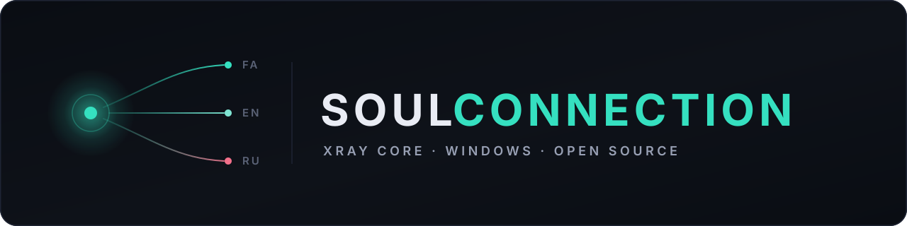

 

### Choose your language · زبان خود را انتخاب کنید · Выберите язык

 

<table>
<tr>
<td align="center" width="33%" valign="top" dir="rtl">

## فارسی

کلاینت V2Ray / Xray برای ویندوز

 

</td>
<td align="center" width="34%" valign="top">

## English

V2Ray / Xray client for Windows

 

</td>
<td align="center" width="33%" valign="top">

## Русский

Клиент V2Ray / Xray для Windows

 

</td>
</tr>
</table>

 

---

 

 

 

VMess · VLESS · Reality · Trojan · Shadowsocks

Made with ❤️ by the Soul Team

