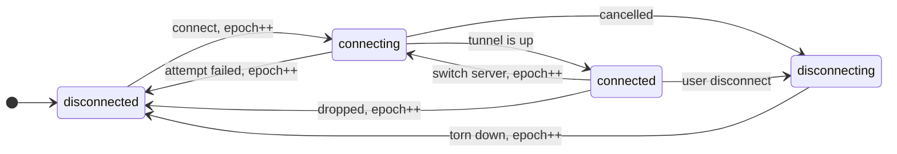
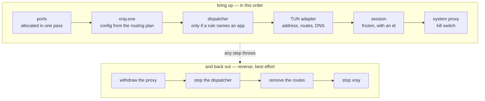

<div align="center">


‎[فارسی](README.fa.md) · [English](README.en.md) · **Русский** · [↩ Выбор языка](README.md)

[](https://github.com/mrsoulcommunity/SoulConnection/releases)
[](https://github.com/mrsoulcommunity/SoulConnection/releases)
[](LICENSE)
[](https://github.com/mrsoulcommunity/SoulConnection/releases/latest)

</div>

---

**Soul Connection — десктопный клиент для серверов VMess, VLESS, Trojan и Shadowsocks.** Он
оборачивает ядро Xray в чистый, полностью персидский интерфейс и добавляет то, что большинство
клиентов оставляет на догадки пользователя: слой против DPI, который *измеряет*, какая обработка
нужна именно вашей сети, правила маршрутизации для отдельных приложений, мониторинг состояния
канала с автоматическим переключением и поиск серверов, показывающий реальную скорость внутри
туннеля, а не голый пинг.

<br>

<div align="center">

[](https://github.com/mrsoulcommunity/SoulConnection/releases/latest)

</div>

<br>

## Установка

Скачайте свежий `setup.exe` со [страницы релизов](https://github.com/mrsoulcommunity/SoulConnection/releases/latest).
Один установщик покрывает **и 32-битную (ia32), и 64-битную (x64) Windows** — он сам определит
систему и поставит нужную сборку. Рекомендуется Windows 10 или новее.

> **Примечание**
>
> Установщик не подписан цифровой подписью, поэтому SmartScreen может предупредить при первом
> запуске: выберите **More info → Run anyway**. Некоторые антивирусы также реагируют на входящий в
> комплект `xray.exe`. Если приложение сообщает, что `xray.exe` не найден, добавьте папку установки
> в исключения антивируса и переустановите.

Есть и **портативная** сборка: она держит всё в папке `data` рядом с исполняемым файлом и не
оставляет следов в системе — удалите папку, и от неё ничего не останется.

<br>

## Возможности

### Подключение

| | |
|---|---|
| **Протоколы** | VMess (AEAD, alterId 0), VLESS с Reality и XTLS Vision, Trojan, Shadowsocks включая шифры 2022-blake3 |
| **Транспорты** | TCP, WebSocket, gRPC, HTTP/2, mKCP — с TLS или Reality |
| **Режимы подключения** | **Системный прокси** прописывает настройки прокси Windows за вас; **Туннель (TUN)** пропускает через Wintun всё устройство и требует прав администратора |
| **Локальный прокси** | Слушатели SOCKS и HTTP на `127.0.0.1` с необязательными логином и паролем. Порты настраиваются и автоматически смещаются на ближайший свободный, если заняты |
| **Kill Switch** | Правила брандмауэра Windows, блокирующие весь исходящий трафик в момент падения туннеля, чтобы ничего не утекло мимо него |
| **Автопереподключение** | Замечает неожиданный обрыв и повторяет попытку с нарастающей паузой. Сколько попыток и какой шаг — решаете вы, и оба значения читаются на лету: изменение действует на следующем же обрыве, а не после перезапуска. Ядро, убитое извне приложения, — такой же обрыв и восстанавливается так же |

### Adaptive Shield — защита от DPI, основанная на измерении, а не на догадках

DPI не может прочитать содержимое трафика, поэтому решает по *форме* первых пакетов. Самая
привлекательная цель — TLS ClientHello: он уходит одной предсказуемой записью и несёт SNI открытым
текстом. У Xray уже есть средства против этого: `fragment` режет ClientHello так, что ни в один
пакет не попадает целое сообщение, а `noises` подмешивает посторонний трафик перед рукопожатием,
портя статистический отпечаток, который собирает классификатор.

Любой другой клиент выдаёт это переключателем, значение которого вам предлагается угадать. Soul
Connection вместо угадывания устраивает им гонку:

- **Он измеряет.** Тюнер прогоняет кандидатов через ваш реальный сервер и оставляет тот, что
  ощутимо выигрывает у обычного соединения. «Без обработки» — полноправный участник гонки, а не
  особый случай: фрагментация стоит лишних round-trip'ов, а шум — трафика, поэтому сеть, которой
  они не нужны, за них и не платит.
- **Он помнит по сетям.** Результат верен только для пары *(сервер, сеть)*. Фрагментация, спасшая
  соединение у мобильного оператора с цензурой, на офисном Wi-Fi — чистые накладные расходы. Каждый
  выбор сохраняется вместе с отпечатком той сети, где он был измерен, и молча игнорируется в
  другой: сменили сеть — подстроится заново, вернулись — прежний ответ на месте.
- **Отпечаток никогда не покидает ваш компьютер.** Это хеш локальной подсети и MAC-адреса
  интерфейса, который сравнивается только сам с собой.

Режимы: `авто` (измерять для каждого сервера), `вручную` (закрепить один профиль), `выкл`.

### Умная маршрутизация

Три режима — всё через прокси, всё напрямую или **Умный**, где решают ваши правила. Правило
срабатывает по исполняемому файлу, домену или по обоим сразу:

| Правило | Результат |
|---|---|
| `chrome.exe` → Прокси | через туннель идёт одно приложение |
| `*.ru` → Напрямую | домен и все его поддомены остаются локальными |
| `steam.exe` + `*.steamcontent.com` → Напрямую | приложение и домен вместе, перебивая более широкое правило |

Домен принимается в любом виде, в каком его обычно вставляют: голое имя, целый URL, точка в начале,
порт в конце. Локальная сеть и localhost по умолчанию мимо туннеля. Один и тот же набор правил
компилируется в конфиг Xray *и* проверяется диспетчером для каждого соединения, поэтому оба уровня
всегда согласованы.

### Выбор сервера

- **Поиск серверов** — TCP-пинг, реальная задержка, измеренная *внутри* туннеля, и скорость
  загрузки и отдачи; всё сводится в одну оценку, по которой можно сортировать.
- **Пул Soul Connection** — отобранный список серверов, который приложение ведёт само, отдельно от
  ваших профилей. Отбор двухступенчатый: сначала дешёвая TCP-проверка по всем серверам, затем
  настоящий тест туннеля на нескольких лучших. Это отсекает классическую беду публичных пулов —
  хост отвечает на `:443`, а туннель у него мёртв или задушен.
- **Автоматическое переключение** — мониторинг следит за потерями, задержкой и джиттером живого
  туннеля и переводит вас при деградации. Три характера (`консервативный`, `сбалансированный`,
  `быстрый`) и четыре независимых тормоза — несколько плохих замеров подряд, реальный запас по
  качеству, пауза после переключения и запрет возвращаться на только что покинутый сервер — так что
  он никогда не мечется между двумя серверами.
- **Измерение целого списка** — пропингуйте все серверы в боковой панели и наблюдайте за этим:
  кнопка на панели инструментов сама становится отчётом — кольцо заполняется по мере поступления
  результатов, рядом живой счётчик, а в центре квадрат «стоп». Остановка действительно
  останавливает: одновременно идёт дюжина измерений, и отмена проверяется между выборками, а не
  оставляется на дюжину таймаутов. Брошенная так строка возвращается к тому, что показывала раньше:
  её не измерили и она не упала, а покрасить её красным значило бы выдумать результат. Когда всё
  заканчивается, полоска сообщает, сколько серверов ответило, какая задержка лучшая и сколько не
  ответило.

### Работа с конфигурациями

- **Подписки** — добавление по URL, обновление вручную или по таймеру, с показом остатка трафика.
- **Массовая вставка** — вставьте одну ссылку или целую стену ссылок; каждая корректная
  конфигурация будет извлечена, дубликаты удалены.
- **QR-код** — покажите любую конфигурацию как QR, скопируйте или сохраните её.
- **Резервная копия** — экспорт и импорт всех профилей, подписок и настроек одним файлом JSON.

### В повседневной работе

- **Живая статистика** — скорость приёма и передачи в реальном времени и суммарный расход по
  каждому серверу, из gRPC StatsService самого Xray.
- **Значок в трее** — подключение, отключение и смена сервера без открытия окна.
- **Поведение при запуске** — старт вместе с Windows, запуск свёрнутым, сворачивание в трей,
  восстановление прошлой сессии.
- **Автообновление** — проверяет GitHub Releases, качает с показом скорости и оставшегося времени,
  проверяет SHA-512 и тихо ставит после отменяемого обратного отсчёта. Загрузка возобновляемая и
  кладётся в папку `Updates` рядом с приложением, поэтому отказ от автоустановки оставляет вам
  готовый установщик, а не пустоту. Политику выбираете вы: `авто`, `только скачивать` или
  `только уведомлять`.

### Настройки, которые находятся

Восемнадцать карточек на пять экранов не пролистывают в поисках одного переключателя, поэтому в
настройках есть поиск: он фильтрует карточки целиком по любому тексту, который они выводят —
заголовку, описанию, подписям, подсказкам и значениям в полях, так что набранный номер порта
находит карточку, в которой он лежит. Арабское и персидское написание одной буквы сводятся вместе,
как и персидские с латинскими цифрами, поэтому «كانفيگ» находит «کانفیگ», а «۱۰۸۰۸» — «10808».
Пароли намеренно исключены из индекса: секрет не должен становиться доступным для поиска оттого,
что его набрали в строке поиска.

- **Уведомления** — главный выключатель плюс по одному на категорию (подключение и отключение,
  автоматическая смена сервера, обновления). Ошибки, на которые нужно реагировать, категории не
  имеют и подчиняются только главному выключателю, поэтому «не сообщай мне о подключении» не может
  заодно заглушить «Kill Switch не удалось применить».
- **DNS режима туннеля** — резолверы, которые режим туннеля отдаёт Windows. Одна настройка кормит
  обе половины, адаптер и собственный DoH-резолвер Xray, поэтому они не могут разойтись. Только
  IPv4, с проверкой в самом поле и ещё раз в главном процессе: Xray отклоняет весь конфиг из-за
  одной плохой записи.
- **Меньше движения** — выключает постоянную фоновую анимацию и укорачивает остальную до почти
  мгновенного перехода. Собственная настройка Windows учитывается отдельно и независимо.
- **Сброс к значениям по умолчанию** — только настройки. Серверы, подписки, правила маршрутизации и
  счётчики трафика — это данные, а не предпочтения, и потерять их из-за кнопки «сбросить настройки»
  было бы непростительно.

### Сделано, чтобы держать кадр

VPN-клиент находится на экране, пока работает, поэтому цифры в нём двигаются непрерывно — а это как
раз тот код, который вероятнее всего потратит бюджет кадра впустую.

- **Телеметрия живёт вне React.** Трафик и задержка раньше были состоянием App, поэтому две цифры в
  подвале раз в секунду перерисовывали всё приложение — всё время, пока вы подключены. Теперь они в
  отдельном store, на который подвал и панель туннеля подписаны напрямую. Замер за десять секунд
  подключения: 31 пропущенный кадр из 566 превратился в 1 из 600, а 95-й перцентиль кадра — с
  33,3 мс, то есть каждый второй кадр мимо, до 16,8 мс.
- **Пинг-прогон публикуется по одному кадру за раз.** Двенадцать одновременных измерений писали
  каждое по два раза, и каждая запись перестраивала боковую панель. Прогон по 400 серверам — было
  10 пропущенных кадров с худшим случаем 116,7 мс, стало ноль при худшем случае 16,8 мс.
- **Анимируются только дешёвые свойства.** Полосы прогресса, свечение кнопки подключения и
  сворачивание панели туннеля анимировали `width`, 152-пиксельный `box-shadow` и `max-height` — всё
  это заново считает раскладку или отрисовку в каждом кадре. Теперь это трансформации, переход по
  прозрачности и строка grid.
- **Один словарь движения.** Четыре длительности и три кривые на `:root`, чтобы две панели, которые
  открываются одинаково, открывались с одной скоростью.

<br>

## Архитектура

Две границы определяют почти всё в устройстве этого приложения. Первая проходит между рендерером и
главным процессом: интерфейс только рисует, а главный процесс владеет всем привилегированным —
процессом Xray, реестром, таблицей маршрутизации, брандмауэром. Встречаются они ровно в одном файле.
Вторая проходит внутри самого главного процесса — между *быть приложением* и *быть подключённым*.


Интерфейс никогда не обращается к Node напрямую. Он говорит с главным процессом только через
preload на `contextBridge`: `nodeIntegration` выключен, рендерер работает в песочнице, а каждый
канал — это либо вызов вида `domain:verb`, либо состояние, отправленное с той стороны. Добавить
новую точку контакта — значит отредактировать ровно три файла, и один из них тот браузерный мок, на
котором разрабатывается интерфейс.

### Подключение — это не одно действие

Это процесс, диспетчер маршрутизации, сетевой адаптер с маршрутами, конфигурация прокси Windows,
блокировка в брандмауэре, три измерительных цикла и движок переключения — и все они должны быть
согласны друг с другом. Раньше эта координация была набором правил порядка, размазанным по
`main.cjs` на 2400 строк, где каждая подсистема заново выводила, должна ли она работать, читая
несколько переменных уровня модуля. Две из них писались *снаружи* блокировки, и именно так
отключение, отданное во время перебора серверов, тихо затиралось тем подключением, которое этот
перебор потом выполнял.

Теперь всё это живёт в `electron/vpn/`, и весь дизайн держится на трёх идеях.

**Одна сессия.** Замороженное значение, описывающее живой туннель, с идентичностью. «Это всё ещё
тот туннель, на который я смотрел?» — это везде `a.id === b.id`. Каждая подсистема *следует* за
сессией, поэтому её повторная рассылка ничего не меняет.

**Одна машина состояний.** Только разрешённые переходы; всё остальное отклоняется, а не
применяется, чтобы падение, случившееся ровно в момент отключения пользователем, не могло отмотать
машину в состояние, которое вызывающий уже прошёл. Счётчик `epoch` считает попытки, поэтому
опоздавший результат распознаётся как устаревший и отбрасывается, а не выполняется.



Любая стрелка, которой здесь нет, отклоняется. `connecting → connected` — намеренно единственная
стрелка, которая `epoch` *не* увеличивает: это два состояния одной и той же попытки, поэтому
работа, начатая во время рукопожатия, остаётся действительной после успеха. А `connected →
connecting` существует потому, что смена сервера действительно начинает новую попытку, пока старый
туннель ещё несёт трафик, — и честная модель этого как раз и позволяет неудачной смене вернуть вас
в `connected` по туннелю, который у вас всё ещё есть, вместо того чтобы отрапортовать «отключено»
поверх живого соединения.

**Одна активность.** Единственный отменяемый отрезок долгой работы — перебор серверов, обратный
отсчёт переподключения. Он существует в одном экземпляре, и запуск следующего отменяет предыдущий.
Именно это делает «пользователь нажал отключить» надёжной остановкой работы, которая ещё не дошла
до блокировки подключения; одному `epoch` это не под силу — отложенное переподключение сидит в
`disconnected`, и увеличивать нечего.

### Вверх по порядку, обратно — в обратном



Порядок здесь не вопрос вкуса. Маршруты обязаны уйти раньше, чем исчезнет адаптер, иначе машина
останется с маршрутами в адаптер, которого больше нет, — и это отсутствие интернета вообще, а не
только через туннель. Диспетчер обязан остановиться раньше Xray, иначе он продолжит принимать
соединения и переправлять их в порты, где никто не слушает. Системный прокси снимается *до* того,
как умрёт слушатель: Windows, указывающий на порт, который только что перестал принимать, — это тот
же обрыв, только с другой стороны.

Если любой шаг подъёма бросает ошибку, всё, что успело войти, выходит обратно прежде, чем ошибка
дойдёт до вызывающего. Уцелевший Xray безобиден только на вид: пока живёт один процесс, `start()`
отказывает, и каждое следующее подключение падало бы с «Xray is already running» до перезапуска
приложения.

### В ядре ничто ничего не строит

`core.cjs` получает каждого соучастника через конструктор — процесс, адаптер, писателя в реестр,
брандмауэр, часы. `index.cjs` — единственный корень композиции, единственный файл, который знает,
какая реализация настоящая, и ничто за пределами `vpn/` не создаёт ничего из `vpn/`. Именно это
делает порядок, отмену и откат проверяемыми без Windows, без Xray и без сети: `npm test` прогоняет
**98 тестов** на собственном раннере Node, без единой зависимости, и проверяет тот *порядок*, в
котором вызовы произошли на самом деле, — там и жили исторические баги.

### Где что лежит

| Путь | Чем владеет |
|---|---|
| `electron/main.cjs` | оболочка Electron — окно, трей, IPC, профили, подписки, настройки |
| `electron/preload.cjs` | вся поверхность `contextBridge` (`window.soul`). Больше наружу не отдаётся ничего |
| `electron/vpn/` | жизненный цикл соединения — машина, сессия, туннель, порты, точки, телеметрия, переключение |
| `electron/lib/` | листовая механика, по одной заботе на файл — хранилище, парсеры, сборщик конфига, края Windows |
| `src/` | рендерер. `App.jsx` держит состояние, компоненты только отображают |
| `test/` | наборы `node:test` по слою координации, собранные на рукописных фейках |

### Данные, которые переживают сбой

Профили, подписки и настройки — один JSON-файл, который пишется устойчиво к сбоям: временный файл
сбрасывается на диск через fsync, текущий копируется в `.bak`, затем атомарный rename ставит новый
на место. Отключение питания оставит вам либо старый файл, либо новый — но никогда половину от
каждого. Нечитаемый файл восстанавливается из резервной копии, а если и она повреждена, файл
отправляется в карантин, а не перезаписывается.

<br>

## Технологии

| Слой | Технология |
|-------|------------|
| **Интерфейс** | React 18 (обычный JSX), рукописный CSS, переменный шрифт Vazirmatn |
| **Оболочка** | Electron 33 |
| **Сборка** | Vite 5 |
| **Ядро** | Xray-core (`xray.exe` в комплекте, для каждой архитектуры) |
| **Статистика** | gRPC (`@grpc/grpc-js`) к StatsService в Xray |
| **Драйвер туннеля** | Wintun (`wintun.dll`) |
| **Тесты** | `node:test` — 98 тестов, без зависимостей, без сети, без Windows |
| **Упаковка** | electron-builder (NSIS) |

<br>

## Сборка из исходников

**Требуется** — [Node.js](https://nodejs.org/) 18 или новее, Git и Windows (приложение и его цели
сборки только под Windows).

```bash
git clone https://github.com/mrsoulcommunity/SoulConnection.git
cd SoulConnection
npm install
```

Папка `bin/` не хранится в git. Перед сборкой положите в неё ядро Xray и драйвер Wintun:

```text
bin/
├── geoip.dat
├── geosite.dat
├── win-x64/
│   ├── xray.exe        # 64-битное ядро Xray
│   └── wintun.dll      # 64-битный драйвер Wintun
└── win-ia32/
    ├── xray.exe        # 32-битное ядро Xray
    └── wintun.dll      # 32-битный драйвер Wintun
```

| Команда | Что делает |
|---------|-------------|
| `npm test` | Прогнать 98 наборов `node:test`. Не нужны ни Windows, ни `bin/` |
| `npm run dev` | Собрать бандл интерфейса и запустить Electron |
| `npm run start` | То же, что `dev` |
| `npm run build:ui` | Собрать только бандл Vite в `dist/` |
| `npm run dist` | Собрать `release/setup.exe` (x64 и ia32 в одном установщике) |
| `npm run dist:publish` | То же, что `dist`, затем публикация в GitHub Releases (нужен `GH_TOKEN`) |
| `npm run dist:portable` | Собрать однофайловую портативную сборку x64 |

<br>

## Структура проекта

```text
SoulConnection/
├── electron/
│   ├── main.cjs              # Оболочка Electron: окно, трей, IPC, профили, подписки
│   ├── preload.cjs           # Вся поверхность contextBridge (window.soul)
│   ├── vpn/                  # ЯДРО VPN — один жизненный цикл, все зависимости внедряются
│   │   ├── core.cjs          #   подключение, отключение, обрывы, переподключение, переключение
│   │   ├── index.cjs         #   корень композиции: единственный файл, который что-то строит
│   │   ├── machine.cjs       #   состояния, эпохи, активности, эксклюзивная блокировка
│   │   ├── session.cjs       #   один живой туннель, замороженный, с идентичностью
│   │   ├── tunnel.cjs        #   xray + диспетчер + маршруты, по порядку, с откатом
│   │   ├── ports.cjs         #   вся раскладка портов, выделяемая за один проход
│   │   ├── endpoints.cjs     #   какой адрес и порт набирать и для чего
│   │   └── …                 #   routingPlan, telemetry, tunnelStatus, killSwitchGuard, reconnect
│   └── lib/
│       ├── shield/           # Adaptive Shield: профили, тюнер, память по сетям
│       ├── routing/          # Умная маршрутизация: чистые правила, диспетчер, компилятор Xray
│       ├── health/           # Измерение (monitor) и политика (failover), разнесены
│       ├── update/           # Фид, возобновляемая загрузка, проверка SHA-512, установщик
│       ├── xrayProcess.cjs   # Время жизни Xray и его поток логов
│       ├── xrayConfig.cjs    # Сборщик конфигурации: inbounds, outbounds, TUN, DNS, щит
│       ├── killSwitch.cjs    # Правила брандмауэра Windows
│       ├── systemProxy.cjs   # Настройки прокси Windows
│       ├── tunNetwork.cjs    # Настройка интерфейса TUN
│       ├── soulPool.cjs      # Отобранный пул серверов
│       └── store.cjs         # Устойчивое к сбоям JSON-хранилище
├── src/
│   ├── App.jsx               # Корневой компонент, держит почти всё состояние рендерера
│   ├── components/           # По файлу на экран или панель
│   ├── finder/               # Движок пакетных тестов в поиске серверов
│   ├── telemetryStore.js     # Трафик и задержка, вне React
│   ├── utils/                # Чистые хелперы: формат, гео, пинг, оценка, сессия
│   └── index.css             # Весь стиль целиком, CSS-переменные на :root
├── test/                     # Наборы node:test по electron/vpn
├── docs/assets/              # Баннер и схема архитектуры
├── bin/                      # Ядро Xray + Wintun (не в git, см. выше)
├── scripts/build-exe.cjs     # Конвейер упаковки
├── vite.config.js
└── package.json              # Здесь же конфигурация electron-builder
```

<br>

## Где лежат ваши данные

Профили, подписки и настройки — один файл JSON:

- **Установленная сборка** — `%APPDATA%\soul-connection\profiles.json`
- **Портативная сборка** — `data\profiles.json`, рядом с исполняемым файлом

<br>

## Устранение неполадок

<details>
<summary><b>Приложение пишет, что <code>xray.exe</code> не найден</b></summary>

Антивирус отправил ядро в карантин. Добавьте папку установки в исключения и переустановите.
</details>

<details>
<summary><b>Не запускается режим туннеля (TUN)</b></summary>

Этот режим ставит виртуальный сетевой интерфейс и требует прав администратора. Запустите приложение
от имени администратора и убедитесь, что `wintun.dll` лежит рядом с `xray.exe`.
</details>

<details>
<summary><b>Подключено, но ничего не открывается</b></summary>

Проверьте, что системный прокси действительно применён (Настройки → Сеть), что умная маршрутизация
не отправляет трафик напрямую, и прогоните тест реальной задержки в поиске серверов — сервер может
отвечать на `:443`, когда туннель у него уже мёртв.
</details>

<details>
<summary><b>В этой сети всё медленно</b></summary>

Дайте Adaptive Shield подстроиться заново. Его результаты хранятся отдельно для каждой сети, поэтому
у нового Wi-Fi или точки доступа их нет, пока он не проведёт измерение.
</details>

<details>
<summary><b>Что-то сломалось, нужны логи</b></summary>

В настройках откройте папку логов. Если нужны подробности, сначала поднимите `xrayLogLevel`.
</details>

<br>

## Участие в разработке

1. Сделайте форк репозитория.
2. Создайте ветку — `git checkout -b feature/amazing-feature`.
3. Закоммитьте изменения и держите `npm test` зелёным — ему не нужны ни Windows, ни `bin/`, так что
   красным наборам в pull request'е оправдания нет.
4. Отправьте ветку и откройте Pull Request.

Прежде чем начать: `CLAUDE.md` в корне репозитория — это карта. Для чего каждая папка, каким
соглашениям следует код и от каких отказов защищает то или иное решение. `electron/vpn/README.md`
подробнее разбирает ядро соединения.

Сообщения об ошибках и предложения ждём в [Issues](https://github.com/mrsoulcommunity/SoulConnection/issues).

<br>

## Лицензия

MIT — см. [LICENSE](LICENSE). Сторонние компоненты в комплекте сохраняют свои лицензии: Xray-core
(MPL-2.0) и Wintun, оба с текстами лицензий в `bin/`.

## Отказ от ответственности

Программа предназначена только для законной защиты приватности и образовательных целей.
Разработчики не несут ответственности за любое злоупотребление. Пользователи обязаны соблюдать
применимые к ним законы и правила в отношении использования интернета и прокси-сервисов.

<br>

<div align="center">

**Soul Community** — [mrsoulcommunity](https://github.com/mrsoulcommunity)

<sub>Сделано с ❤️ командой Soul</sub>

[GitHub](https://github.com/mrsoulcommunity/SoulConnection) ·
[Issues](https://github.com/mrsoulcommunity/SoulConnection/issues) ·
[Releases](https://github.com/mrsoulcommunity/SoulConnection/releases)

</div>
